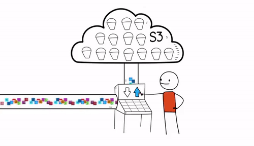
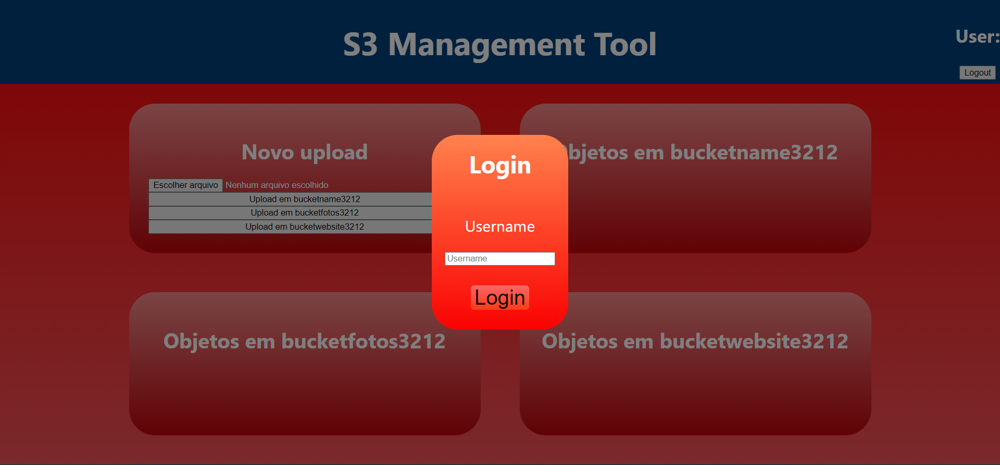

# S3-Management-Tool

<div align="center" style="max-width:68rem;">
<center></center>
</div>

## Sobre

Ferramenta de gerenciamento do S3, que permite a criação da infraestrutura abaixo, provisionando diferentes buckets para armazenamento de objetos, e notificação para o email cadastrado de novos itens adicionados nesses buckets:

<div align="center">
  
</div>

Encontra-se também no projeto a criação de uma interface que gerencia usuários e seus respectivos arquivos nos Buckets criados:
<div align="center">
  
</div>

## [Documentação](https://niveaabreu.github.io/S3-Management-Tool/)

Você pode conferir a documentação de construção desse projeto pelo seguinte [link](https://niveaabreu.github.io/S3-Management-Tool/)

## Para executar o projeto

Para executar este projeto, siga as etapas a seguir:

* Projeto é baseado em sistemas operacionais Unix, logo execute-o em um, ou no caso de Windows, execute-o via WSL2;
* Clone o repositório:
```bash
git clone https://github.com/niveaabreu/S3-Management-Tool
cd S3-Management-Tool
```
* Exporte suas credenciais da AWS como variavéis de ambiente:
```bash
export AWS_ACCESS_KEY_ID=<ID_CHAVE_DE_ACESSO>
export AWS_SECRET_ACCESS_KEY=<CHAVE_SECRETA_DE_ACESSO>
```

* Execute o provisionamento da arquitetura passando os parâmetros desejados:
```bash
terraform init
terraform plan
terraform apply -var="<email>" \ 
                -var="<nome_bucket>"   \
                -var="<nome_bucket>"\ 
                -var="<nome_bucket>" \
                -auto-approve

```
* Após a criação da infraestrutura, entre na pasta **interface**, instale as dependências:
```bash
cd interface
npm install
```

* Crie um arquivo **.env** dentro da pasta **src/** de variável de ambiente para utilizar para permissões na Interface:
 ```env
REACT_APP_AWS_ACCESS_KEY_ID=<access_key_id>
REACT_APP_AWS_SECRET_ACCESS_KEY=<secret_key>
```

* Execute a interface:
```bash
npm start
```

Você verá a interface na porta local 3000. Faça bom uso da plataforma :)

