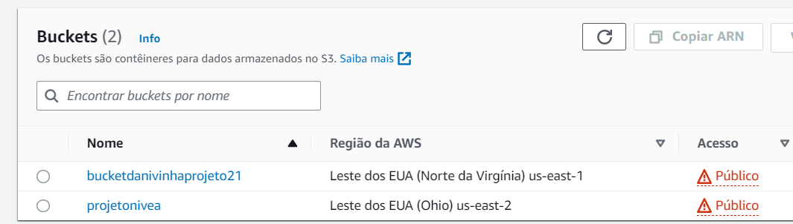

# Ferramenta de Gerenciamento do Amazon S3

Esta é uma ferramenta/produto de gerenciamento de buckets S3, instancias de armazenamento, com templates terraform tipo como se fosse um "google drive". 

Com esta ferramenta, será  possível criar-se novos buckets no S3, gerenciar suas permissões de acesso, criação de folders, criação de políticas. Será possível também a listagem de buckets na conta do usuários, objetos em um bucket especificado, configurações de lifecycle. 

Por fim, pretende-se a criação de uma simples interface web que possibilite o upload de objetos no bucket, assim como listagem,  download e exclusão destes caso seja do desejo do usuário. Notificação para saber qual bucket foi modificado.
<div align="center">

</div>
## Pré requisitos
Para execução adequada deste roteiro, são necessários os seguintes pré-requisitos:

* Ubuntu > 20.0 ou WSL2
* Terraform
* Python > 3.6
* Conta na AWS com usuário com permissões de administrador

## Recursos essenciais da ferramenta

Queremos, ao fim desse roteiro, provisionar uma arquitetura como a abaixo:

<div align="center">

</div>

Que será capaz de criar um sistema de armazenamento de arquivos e até site estático, com funcionalidade de gerar notificações ao dono desses recursos para cada objeto adicionado nos buckets, criando assim além de grande disponibilidade e facilidade de uso, uma arquitetura altamente rastreável, permitindo a verificação mais rápido de erros e brechas de segurança.


### AWS

É uma plataforma de serviços de computação em nuvem oferecida pela Amazon, que permite que indivíduos e organizações implementem aplicativos, serviços e infraestrutura na nuvem. A AWS oferece uma ampla variedade de serviços em nuvem, incluindo computação, armazentamento, banco de dados, análise, inteligência artificial, machine learning e muito mais.

Para conseguir interagir com os serviços e funções que a AWS provém, por meio de IaC (Infrastructure as Code), é necessário obter [chaves de acesso](https://docs.aws.amazon.com/IAM/latest/UserGuide/id_credentials_access-keys.html), que permitam o gerenciamento e provisionamento dos recursos que desejamos alocar na nuvem.

De posse de suas respectivas chaves de acesso, crie duas variáveis de ambiente, conforme padrão abaixo:

```bash
export AWS_ACCESS_KEY_ID=<ID_CHAVE_DE_ACESSO>
export AWS_SECRET_ACCESS_KEY=<CHAVE_SECRETA_DE_ACESSO>

```
Realiza-se o acesso a essas chaves para segurança de dados de quem acessa, pois assim evita-se sempre ter que colocar a senha no ambiente e a senha estar exposta

### S3

É um serviço de armanezamento de objetos oferecido pela Amazon Web Services (AWS). O S3 permite que os usuários armazenem e recuperem arquivos de qualquer lugar da web.
O S3 é amplamente utilizado por empresas e organizações de diferentes setores para armazenamento e compartilhamento de arquivos, backup e arquivamento de dados, hospedagem de sites e aplicativos, e muito mais.

### Bucket

Bucket é um conceito de armazenamento usado em serviços de armazenamento em nuvem, como o Amazon S3. Um bucket pode ser considerado como um contêiner de objetos, que pode armazenar e gerenciar vários objetos, como arquivos, imagens, vídeos, entre outros. Os buckets são amplamente utilizados para hospedar sites estáticos, armazenamento de backup, arquivamento de dados e muito mais. Eles são uma parte essencial de muitos serviços em nuvem e permitem que os usuários armazenem, gerenciem e acessem dados de qualquer lugar da web.


### Terraform
 
 É uma infraestrutura que descreve os recursos que você deseja provisionar, como servidores, banco de dados e outros. Além disso, você pode usar o Terraform para criar, alterar e destruir recursos automaticamente.

 
 
### S3 Events

O Amazon S3 Events permite que você monitore alterações em seu bucket do Amazon S3 e responda essas alterações executando ações automáticas. Quando um evento ocorre em seu bucket como upload de um arquivo ou a exclusão de um objeto o S3 Events pode acusar uma ação automática como a invocação de uma função AWS Lambda ou a notificação de um tópico do Amazon Simple Notificacion Service (SNS).

### Função AWS Lambda

As Funções AWS Lambda fazem o processamento de eventos em tempo real como logs e notificações. Por exemplo, você pode criar uma função lambda que é acionada sempre que um novo objeto é enviado para um bucket do Amazon S3. A função pode processar o objeto, extrair informações relevantes, executar transformações ou armazenar dados em outros serviço. 


### Amazon Simple Notification Service (SNS)

O SNS é um serviço de mensagens e notificação da AWS que permite enviar mensagens para diferentes tipos de endpoints como emails, mensagens de texto(SMS), URLs entre outros. Além disso, você pode configurar o acesso para quem pode publicar e para quem pode se inscrever no tópico.

### CloudWatch Alarm

O CloudWatch Alarm é um serviço de monitoramento e observabilidade da AWS. O CloudWatch Alarm permite monitorar métricas específicas e acionar ações automáticas com base em condições predefinidas.


## Iniciando nossa infraestrutura

Crie uma pasta para organizar nossos arquivos chamada **terraform/**::

```bash
mkdir terraform 
cd terraform
```

Como nosso primeiro objetivo é criar um bucket na AWS crie um template chamado **s3.tf** com o seguinte conteúdo:

```terraform title="s3.tf"
#Provider and default region used
provider "aws" {
  region     = "us-east-2"
}

resource "aws_s3_bucket" "exemplo" {
  bucket = "<Nome do bucket>"

  tags = {
    Name        = "My bucket"
    Environment = "Dev"
  }
}
```

:warning: **Subistitua o nome do bucket pelo que você deseja, lembrando que esse nome é único em toda AWS**

Inicie então os recursos terraform necessários para provisionar rodando o comando abaixo:


```bash
terraform init
```

Agora veremos o plano de criação desses recursos:

```bash 
terraform plan
```

Por fim, realize deploy deste recurso na nuvem:

```bash
terraform apply -auto-approve
```

Caso tudo dê certo você verá isso no console da AWS


<div align="center">

</div>


## Como subir um site estático por Terraform

Agora que já conseguimos subir um bucket privado de uso geral, podemos também modificar nossa infraestrutura para provisionar buckets que disponibilizem páginas estáticas, conforme nosso plano de infraestrutura.
Para isso, devemos...

* Fazer um provedor de nuvem da AWS
* Especificar o recurso que se quer criar : um bucket
* Define-se os controles do bucket
* Definir os acesso publico pra tirar esse bloqueio do 
* Definir qual o acesso do bucket
* Definir uma nova configuração de bucket
* Política de acesso a leitura do bucket
* Configurações e buckets de indexar pagina 

Para isso, crie um novo arquivo chamado s3_website, que irá realizar os passos acima:

```terraform title="s3_website.tf"
provider "aws" {
  region = "us-east-1" # Substitua pela região desejada
}

resource "aws_s3_bucket" "website" {
  bucket = "bucketdanivinhaprojeto21"
}

resource "aws_s3_bucket_ownership_controls" "example" {
  bucket = aws_s3_bucket.website.id
  rule {
    object_ownership = "BucketOwnerPreferred"
  }
}

resource "aws_s3_bucket_public_access_block" "example" {
  bucket = aws_s3_bucket.website.id

  block_public_acls       = false
  block_public_policy     = false
  ignore_public_acls      = false
  restrict_public_buckets = false
}

resource "aws_s3_bucket_acl" "example" {
  depends_on = [
    aws_s3_bucket_ownership_controls.example,
    aws_s3_bucket_public_access_block.example,
  ]

  bucket = aws_s3_bucket.website.id
  acl    = "public-read"
}

resource "aws_s3_bucket_versioning" "website" {
  bucket = aws_s3_bucket.website.id
  versioning_configuration {
    status = "Enabled"
  }
}

data "aws_caller_identity" "current" {}

resource "aws_s3_bucket_policy" "public_read_access" {
  bucket = aws_s3_bucket.website.id
  policy = data.aws_iam_policy_document.public_read_access.json
}

data "aws_iam_policy_document" "public_read_access" {
  statement {
    principals {
	  type = "*"
	  identifiers = ["*"]
	}

    actions = [
      "s3:GetObject",
      "s3:ListBucket",
    ]

    resources = [
      aws_s3_bucket.website.arn,
      "${aws_s3_bucket.website.arn}/*",
    ]
  }
}

resource "aws_s3_bucket_website_configuration" "website" {
  bucket = aws_s3_bucket.website.bucket

  index_document {
    suffix = "index.html"
  }

}

resource "aws_s3_object" "index_page" {
  bucket       = aws_s3_bucket.website.id
  key          = "index.html"
  content_type = "text/html; charset=UTF-8"
  source       = "index.html"
} 
```

Na mesma pasta crie um arquivo chamado **index.html** e coloque o seguinte conteúdo nele:

```html 
<h1>Hello World</h1>
```

Inicie então os recursos terraform necessários para provisionar rodando o comando abaixo:


```bash
terraform init
```

Agora veremos o plano de criação desses recursos:

```bash 
terraform plan
```

Por fim, realize deploy deste recurso na nuvem:

```bash
terraform apply -auto-approve
```

Caso tudo dê certo você verá isso no console da AWS

<div align="center">

</div>

E a pagina você verá isso
<div align="center">

</div>

Fica disponibilizado o link em que você pode verificar:

```html 
http://bucketdanivinhaprojeto21.s3-website-us-east-1.amazonaws.com
```
## S3 events engatilhando uma função Lambda

Já conseguimos criar diferentes buckets que contemplam sua função: 

**Armazenar objetos**

Para se adequar a nossa arquitetura desejada, devemos então integrar o *S3 events*, um notificador de eventos próprio do Amazon S3 para engatilhar uma função Lambda a cada vez que um novo objeto for adicionado neste bucket.

Para isso, precisamos então:

* Configurar S3 events nos buckets que já possuímos;
* Criar um template que provisiona uma função Lambda que será engatilhada por esse evento
* Criar permissões que autorizem o S3 events a engatilhar a função.

Para isso, iremos utilizar módulos do terraform, para melhorar a organização de nossos templates e também facilitar a conexão entre esses templates, conforme será necessário.

Crie três pastas, chamadas respectivamente **lambda**, **s3** e **s3_website**:

```bash
mkdir lambda
mkdir s3
mkdir s3_website
```

Mova o arquivo **s3.tf** para a pasta **s3/**, **s3_website.tf** para **s3_website/** e crie um arquivo **lambda.tf** para a pasta **lambda/**. Não coloque nada nesse arquivo ainda.

Modifique o arquivo **s3.tf**, adicionando os componentes de permissão para a execução da Lambda e notificação do S3.

```terraform title="s3.tf"
variable "function_name" {
  type = string
}

variable "function_arn" {
  type = string
}


resource "aws_s3_bucket" "exemplo" {
  bucket = "bucket-nivea-456864"

  tags = {
    Name        = "My bucket"
    Environment = "Dev"
  }
}


resource "aws_lambda_permission" "exemplo" {
  statement_id  = "example-statement-id"
  action        = "lambda:InvokeFunction"
  function_name =  var.function_name
 principal     = "s3.amazonaws.com"
  source_arn    = "${aws_s3_bucket.exemplo.arn}/"
}

module "s3_notification" {
  source  = "terraform-aws-modules/s3-bucket/aws//modules/notification"
  version = "~> 3.0"

  bucket = aws_s3_bucket.exemplo.id
  eventbridge = true

  lambda_notifications = {
    lambda = {
      function_arn  = var.function_arn
      function_name = var.function_name
      events        = ["s3:ObjectCreated:*"]
    }
  }
}
```

Dentro da pasta **lambda/**, crie um arquivo chamado **events.py**, com o seguinte conteúdo:

```python title="events.py"
import json 

def lambda_handler(event, context):
    print("Novo objeto adicionado")
    return {
        'statusCode': 200,
        'body': json.dumps('Hello from Lambda!')
    }

```

Compacte  função usando seu compactador preferido (Winrar, Zip e etc), para criar um arquivo chamado **events.zip** que contenha o arquivo **events.py**.

Crie então o arquivo **lambda.tf** na atual pasta, que irá criar:

* A função propriamente dita, com sua linguagem de programação, nome e outras configurações;
* Role com permissões necessárias;
* Políticas de permissões necessárias;
* Output para passar detalhes da função para o template do S3.

Assim crie:

```terraform title="lambda.tf"
resource "aws_lambda_function" "example" {
  function_name = "events"
  runtime = "python3.8"
  handler = "events.lambda_handler"
  role = aws_iam_role.lambda.arn

  filename = "lambda/events.zip"

  environment {
    variables = {
      EXAMPLE_VARIABLE = "example_value"
    }
  }
}

resource "aws_iam_role" "lambda" {
  name = "a1s3-events-execution-lambda"

  assume_role_policy = jsonencode({
    Version = "2012-10-17"
    Statement = [
      {
        Action = "sts:AssumeRole"
        Effect = "Allow"
        Principal = {
          Service = "lambda.amazonaws.com"
        }
      }
    ]
  })
}

resource "aws_iam_role_policy_attachment" "lambda" {
  policy_arn = "arn:aws:iam::aws:policy/service-role/AWSLambdaBasicExecutionRole"
  role       = aws_iam_role.lambda.name
}

output "function_name" {
  value = aws_lambda_function.example.function_name
}

output "function_arn" {
  value = aws_lambda_function.example.arn
}
```

Retorne para o diretório **terraform/**:
```bash
cd ..
```

Crie um arquivo **main.tf**, que irá reunir e referenciar os módulos agora criados:

* Módulo Lambda e seus outputs(nome e ARN);
* Módulo S3;
* Módulo S3-Website

```terraform title="main.tf"
provider "aws" {
  region     = "us-east-1"
}

module "lambda" {
  source = "./lambda"
}

output "function_name" {
  value = module.lambda.function_name
}

output "function_arn" {
  value = module.lambda.function_arn
}

module "s3" {
  source = "./s3"
  function_name = module.lambda.function_name
  function_arn = module.lambda.function_arn
}

module "website" {
  source = "./s3_website"
}
```

Dessa forma sua organização de diretório deve ficar assim:

```
terraform/
  |
  ------main.tf
  |
  ------lambda/
      |
      ------lambda.tf
  |
  ------s3/
      |
      ------s3.tf
  |
  ------s3_website/
      |
      ------s3_website.tf
```

Rode em seu terminal para iniciar novamente o backend:

```
terraform init
```

Veja se o acoplamento lógico dos componentes está correto:

```
terraform plan
```

Aplique as mudanças:

```
terraform apply -auto-approve
```
Estando tudo correto, você deverá em seu console, além dos buckets anteriormente criados, a seguinte função:

<div align="center">

</div>

## Criando um tópico de notificações no SNS

Até então conseguimos provisionar um bucket e uma função Lambda engatilhada a cada novo objeto adicionado neste bucket. 
Precisamos então, criar uma notificação que avise algum dos desenvolvedores ou dono da infraestrutura, que um novo objeto foi adicionado, gerando assim, maior controle da infraestrutura e suas mudanças.

Dessa forma, iremos utilizar o SNS, que conforme explicado no começo deste roteiro, tem por seu fim, enviar notificações para diferentes meios, como **email, SMS, HTTP e outros**. Para este projeto, iremos configurar um tópico SNS que irá enviar uma solicitação par um email cadastrado.

Dessa forma, crie uma pasta chamada **SNS/** dentro do diretório **terraform/**, e adicione o arquivo **sns.tf**.

Este irá conter:

* O nome do tópico a ser criado;
* O protocolo de envio do tópico (email) e a endpoit de envio (seu endereço de email);
* E um output do ARN do recurso criado para uso posterior.

Assim, coloque no arquivo **sns.tf**:

```terraform title="sns.tf"
resource "aws_sns_topic" "example_topic" {
  name = "example-topic"
}

variable "email_subscription" {
  type    = string
  default = "teste@al.insper.edu.br" # Insira seu email
}

resource "aws_sns_topic_subscription" "email_subscription" {
  topic_arn = aws_sns_topic.example_topic.arn
  protocol  = "email"
  endpoint  = var.email_subscription
}

output "sns_arn" {
  value = aws_sns_topic.example_topic.arn
}
```


Dessa forma sua organização de diretório deve ficar assim:

```
terraform/
  |
  ------main.tf
  |
  ------lambda/
      |
      ------lambda.tf
  |
  ------sns/
      |
      ------sns.tf
  |
  ------s3/
      |
      ------s3.tf
  |
  ------s3_website/
      |
      ------s3_website.tf
```

Retorne para o diretório **terraform/** e adeque seu arquivo **main.tf** para conter o módulo **sns/**:

```terraform title="main.tf"
provider "aws" {
  region     = "us-east-1"
}

module "lambda" {
  source = "./lambda"
}

output "function_name" {
  value = module.lambda.function_name
}

output "function_arn" {
  value = module.lambda.function_arn
}

module "s3" {
  source = "./s3"
  function_name = module.lambda.function_name
  function_arn = module.lambda.function_arn
}

module "website" {
  source = "./s3_website"
}

module "sns" {
  source = "./sns"
}

output "sns_arn" {
  value = module.sns.sns_arn
}
```

Rode em seu terminal para iniciar novamente o backend:

```
terraform init
```

Veja se o acoplamento lógico dos componentes está correto:

```
terraform plan
```

Aplique as mudanças:

```
terraform apply -auto-approve
```
Estando tudo correto, você deverá em seu console, o tópico criado:

<div align="center">

</div>


## Criando um alarme no Cloudwatch 

Já conseguimos então ter uma função Lambda que é engatilhada a cada novo objeto colocado em um bucket e um tópico no SNS que consegue gerar notificações de email para o usuário cadastrado.

Precisamos então criar um componente que irá ser o conector entre estes, isto é, a cada vez que uma função Lambda for engatilhada, gerar uma notificação para o usuário via SNS.

Para isso, podemos criar um alarme no Cloudwatch que irá monitorar os logs padrões gerados pela Lambda, e com isso, gera uma notificação no tópico.

Dessa forma, devemos criar um alarme que:

* Receberá o ARN do tópico que irá gerar a notificação;
* Irá filtrar nos logs da função Lambda desejada (aqui por padrão chamada de **events**);
* Criar um alarme no Cloudwatch que irá transicionar do estado **OK** para **ALARM** a cada novo log irá tomar a ação de criar uma notificação no tópico que o ARN for passado ao template.

Crie um arquivo chamado **cloudwatch.tf** em uma pasta chamada **cloudwatch/** dentro do diretório **terraform/**:

```
mkdir cloudwatch
```

Coloque o arquivo da seguinte maneira:

```terraform title="cloudwatch.tf"
variable "sns_arn" {
  type = string
}

resource "aws_cloudwatch_log_metric_filter" "lambda_log_filter" {
  name           = "lambda-log-filter"
  pattern        = "{ $.eventType = Error }" # Substitua pelo padrão que você deseja monitorar
  log_group_name = "/aws/lambda/events"      # Substitua pelo nome do grupo de log correto

  metric_transformation {
    name        = "ErrorCount"
    namespace   = "Custom/CloudWatchLogs"
    value       = "1"
    default_value = "0"
  }
}

resource "aws_cloudwatch_metric_alarm" "lambda_log_alarm" {
  alarm_name          = "lambda-log-alarm"
  alarm_description   = "Alarm triggered on CloudWatch Logs"
  comparison_operator = "GreaterThanOrEqualToThreshold"
  evaluation_periods  = "1"
  metric_name         = "ErrorCount"
  namespace           = "Custom/CloudWatchLogs"
  period              = "60"
  statistic           = "SampleCount"
  threshold           = "1"
  alarm_actions       = [var.sns_arn]
  treat_missing_data  = "missing"
}

resource "aws_cloudwatch_log_metric_filter" "lambda_log_filter_subscription" {
  name           = "lambda-log-filter-subscription"
  pattern        = "{ $.eventType = Error }" # Substitua pelo padrão que você deseja monitorar
  log_group_name = "/aws/lambda/events"      # Substitua pelo nome do grupo de log correto

  metric_transformation {
    name      = "ErrorCountSubscription"
    namespace = "Custom/CloudWatchLogs"
    value     = "1"
  }
}


```
Dessa forma sua organização de diretório deve ficar assim:

```
terraform/
  |
  ------main.tf
  |
  ------lambda/
      |
      ------lambda.tf
  |
  ------sns/
      |
      ------sns.tf
  |
  ------s3/
      |
      ------s3.tf
  |
  ------s3_website/
      |
      ------s3_website.tf
  |
  ------cloudwatch/
    |
    ------cloudwatch.tf
```

Modifique o arquivo **main.tf**, para adequar o módulo recém criado:

Veja que passamos o ARN do tópico do SNS criado como uma variável para o Cloudwatch Alarme.

```terraform title="main.tf"
provider "aws" {
  region     = "us-east-1"
}

module "lambda" {
  source = "./lambda"
}

output "function_name" {
  value = module.lambda.function_name
}

output "function_arn" {
  value = module.lambda.function_arn
}

module "s3" {
  source = "./s3"
  function_name = module.lambda.function_name
  function_arn = module.lambda.function_arn
}

module "website" {
  source = "./s3_website"
}

module "sns" {
  source = "./sns"
}

output "sns_arn" {
  value = module.sns.sns_arn
}

module "cloudwatch" {
  source = "./cloudwatch"
  sns_arn = module.sns.sns_arn
}
```

Rode em seu terminal para iniciar novamente o backend:

```
terraform init
```

Veja se o acoplamento lógico dos componentes está correto:

```
terraform plan
```

Aplique as mudanças:

```
terraform apply -auto-approve
```
Estando tudo correto, você deverá em seu console, o alarme do Cloudwatch criado:

<div align="center">

</div>

Veja em seu email cadastrado que você deve ter recebido uma notificação:

<div align="center">

</div>

Para testar o funcionamento da arquitetura, adicione um objeto qualquer ao Bucket S3 recém criado. Depois de alguns minutos você deverá receber um email como o abaixo, indicando que o Alarme do CloudWatch Alarme foi acionado e um novo objeto foi adicionado no bucket.

Cloudwatch notificando alarme:

<div align="center">

</div>


Email de notificação:

<div align="center">

</div>

## Criando mais um Bucket e passando nomes como variáveis

Apesar de já conseguirmos ter um Bucket padrão que engatilha notificações em um email previamente cadastrado e um bucket próprio para hosteamento de sites estáticos, nossa arquitetura desejada prevê a criação de um outro bucket para simular a divisão entre buckets.

Além disso, seria ideal que conseguimos, no momento da criação (*terraform apply*), os nomes dos buckets e o email de destino para notificações, facilitando assim o controle de erros (advindos do nome único de buckets) e mudança de valores desejados (ao invés de ter que modificar o template propriamente).

<div align="center">

</div>

Assim, devemos:

* Criar um outro bucket (genericamente destinado a fotos, mas pode ser utilizado para outros fins do usuário);
* Generalizar o nome dos buckets e do email cadastrado (permitindo estes serem passados como variáveis no momento de deploy da arquitetura);

Para isso, primeiramente, crie uma pasta dentro de **terraform/** chamada (genericamente), de *s3_fotos*. Nesta pasta, crie um arquivo chamado **s3_fotos.tf**, onde iremos:

* Criar um bucket genericamente para fotos;
* Criar um evento de S3 events para este;
* Criar variáveis que permitam a passagem de nomes (nome do bucket e valores da função Lambda associada) durante criação (ou usar defaults);

Assim, crie o arquivo da seguinte forma:

```terraform title="s3_fotos.tf"
variable "function_name" {
  type = string
}

variable "function_arn" {
  type = string
}

variable "fotos_name" {
  type = string
  default = "ProjetoBucket132"
}

resource "aws_s3_bucket" "exemplo_fotos" {
  bucket = var.fotos_name

  cors_rule {
    allowed_origins = ["*"]
    allowed_methods = ["GET", "PUT", "POST", "DELETE"]
    allowed_headers = ["*"]
  }

  tags = {
    Name        = "My bucket"
    Environment = "Dev"
  }
}

resource "aws_lambda_permission" "exemplo_fotos" {
  statement_id  = "fotos-statement-id"
  action        = "lambda:InvokeFunction"
  function_name =  var.function_name
 principal     = "s3.amazonaws.com"
  source_arn    = "${aws_s3_bucket.exemplo_fotos.arn}/"
}

module "s3_notification" {
  source  = "terraform-aws-modules/s3-bucket/aws//modules/notification"
  version = "~> 3.0"

  bucket = aws_s3_bucket.exemplo_fotos.id
  eventbridge = true

  lambda_notifications = {
    lambda = {
      function_arn  = var.function_arn
      function_name = var.function_name
      events        = ["s3:ObjectCreated:*"]
    }
  }
}
```

Dessa forma, nosso diretório ficará com a seguinte estrutura:
```
terraform/
  |
  ------main.tf
  |
  ------lambda/
      |
      ------lambda.tf
  |
  ------sns/
      |
      ------sns.tf
  |
  ------s3_fotos/
      |
      ------s3_fotos.tf
  |
  ------s3/
      |
      ------s3.tf
  |
  ------s3_website/
      |
      ------s3_website.tf
  |
  ------cloudwatch/
    |
    ------cloudwatch.tf
```

Devemos agora então, modificar em sequência:

* Adicionar um evento de S3 events para o bucket de Website;
* Criar variáveis da função Lambda e nome do website no bucket de hosteamento;
* Criar variável de nome do bucket para o Bucket principal;
* Criar variáveis de nomes para os buckets e e de email e referenciar nos respectivos módulo no arquivo **main.tf**;

Assim, altere e/ou adicione seu arquivo **s3_website** as seguintes linhas (adicionando as duas primeiras mudanças citadas acima):

:warning: Veja que o arquivo abaixo está incompleto para diminuir espaço, não o copie apenas, e sim substitua/adicione as partes aqui ilustradas

```terraform title="s3_website.tf" hl_lines="24"
variable "function_name" {
  type = string
}

variable "function_arn" {
  type = string
}

variable "website_name" {
  type = string
  default = "ProjetoBucket131"
}

resource "aws_s3_bucket" "website" {
  bucket = var.website_name

    cors_rule {
    allowed_origins = ["*"]
    allowed_methods = ["GET", "PUT", "POST", "DELETE"]
    allowed_headers = ["*"]
  }

}
...
resource "aws_lambda_permission" "website" {
  statement_id  = "website-statement-id"
  action        = "lambda:InvokeFunction"
  function_name =  var.function_name
 principal     = "s3.amazonaws.com"
  source_arn    = "${aws_s3_bucket.website.arn}/"
}

module "s3_notification" {
  source  = "terraform-aws-modules/s3-bucket/aws//modules/notification"
  version = "~> 3.0"

  bucket = aws_s3_bucket.website.id
  eventbridge = true

  lambda_notifications = {
    lambda = {
      function_arn  = var.function_arn
      function_name = var.function_name
      events        = ["s3:ObjectCreated:*"]
    }
  }
}

```
Posteriormente, no arquivo **s3_bucket.tf**, adicione referências para a variável de nome do bucket:

```terraform title="s3.tf"
variable "function_name" {
  type = string
}

variable "function_arn" {
  type = string
}

variable "bucket_name" {
  type = string
  default = "ProjetoBucket130"
}

resource "aws_s3_bucket" "exemplo" {
  bucket = var.bucket_name

  cors_rule {
  allowed_origins = ["*"]
  allowed_methods = ["GET", "PUT", "POST", "DELETE"]
  allowed_headers = ["*"]
  }

  tags = {
    Name        = "My bucket"
    Environment = "Dev"
  }
}

resource "aws_lambda_permission" "exemplo" {
  statement_id  = "documentos-statement-id"
  action        = "lambda:InvokeFunction"
  function_name =  var.function_name
  principal     = "s3.amazonaws.com"
  source_arn    = "${aws_s3_bucket.exemplo.arn}/"
}

module "s3_notification" {
  source  = "terraform-aws-modules/s3-bucket/aws//modules/notification"
  version = "~> 3.0"
  bucket = aws_s3_bucket.exemplo.id
  eventbridge = true

  lambda_notifications = {
    lambda = {
      function_arn  = var.function_arn
      function_name = var.function_name
      events        = ["s3:ObjectCreated:*"]
    }
  }
}

```

Por fim, no arquivo **main.tf**, crie as variáveis necessárias, e as repasse para seus respectivos módulos, conforme arquivo abaixo:

```terraform title="main.tf"
provider "aws" {
  region     = "us-east-1"
}

module "lambda" {
  source = "./lambda"
}

output "function_name" {
  value = module.lambda.function_name
}

output "function_arn" {
  value = module.lambda.function_arn
}

module "s3" {
  source = "./s3"
  bucket_name = var.bucket_name
  function_name = module.lambda.function_name
  function_arn = module.lambda.function_arn
}

module "fotos" {
  source = "./s3_fotos"
  fotos_name = var.fotos_name
  function_name = module.lambda.function_name
  function_arn = module.lambda.function_arn
}

module "website" {
  source = "./s3_website"
  website_name = var.website_name
  function_name = module.lambda.function_name
  function_arn = module.lambda.function_arn
}

module "sns" {
  source = "./sns"
  email_subscription = var.email
}

output "sns_arn" {
  value = module.sns.sns_arn
}

module "cloudwatch" {
  source = "./cloudwatch"
  sns_arn = module.sns.sns_arn
}

variable "bucket_name" {
  type = string
  default = "ProjetoBucket130"
}

variable "website_name" {
  type = string
  default = "ProjetoBucket131"
}

variable "fotos_name" {
  type = string
  default = "ProjetoBucket132"
}

variable "email" {
  type = string
  default = "niveaadl@al.insper.edu.br"
}
```

Caso tudo esteja corretamente, configurado, inicie novamente seu ambiente para carregamento de módulos:

```bash
terraform init
```

Verifique se o acoplamento lógico dos recursos é coerente (principalmente com as variáveis passadas) para resolução de problemas:

```bash
terraform plan
```

Caso tudo esteja certo, execute o comando de deploy modificando as variáveis para os nomes e email desejados.
```bash
terraform apply -var="email=niveaadl@al.insper.edu" \ 
                -var="fotos_name=bucketfotos3211"   \
                -var="website_name=bucketwebsite3211"\ 
                -var="bucket_name=bucketname3211" \
                -auto-approve
```

Ao fim da execução, você deverá ter em seu console a criação de:

* 3 buckets;
* Função Lambda;
* Tópico SNS;
* Alarme do Cloudwatch;
* Permissão de execução dos recursos;

<div align="center">

</div>

Finalizando nossa arquitetura desejada na nuvem.

<div align="center">

</div>


## Criando uma interface para gerenciar Uploads e Downloads nos Buckets
Apesar de já conseguirmos criar nossa arquitetura funcional em Cloud, é um pouco "massante" ter que abrir o dashboard para tarefas simples e rotineiras como incluir arquivos e fazer download de outros.

Analogamente, seria interessante criar uma estrutura de usuários nessa interface que limita-se as permissões de cada usuário, isto é, cada user pode apenas ver seus próprios arquivos.

Para isso iremos:

* Criar uma interface em React para facilitar o gerenciamento de buckets e noção de usuários;
* Utilizar SDK da AWS para interagir com os buckets recém criados;

Para isso, inicialmente instale o Node 18>:

```bash
curl -sL https://deb.nodesource.com/setup_18.x -o nodesource_setup.sh
sudo bash nodesource_setup.sh
sudo apt install nodejs
```

Volte para o diretório raiz do projeto e crie um app React:

```bash
npx create-react-app interface
```

Configure o npm para utilizarmos recursos de SDK da AWS com React.js:

```bash
npm install aws-sdk
npm install  env-cmd
```
Após a instalação, entre na pasta **src** do diretório e crie um arquivo **.env** com as suas credenciais para utilização na SDK da AWS:

```bash
cd interface/src
nano .env
```

Coloque o seguinte conteúdo no arquivo:

```env
REACT_APP_AWS_ACCESS_KEY_ID=<access_key_id>
REACT_APP_AWS_SECRET_ACCESS_KEY=<secret_key>
```

No arquivo **package.json**, adicione a referência ao modulo env-cmd para permitir a utilização das variavéis de ambiente:

```json title="package.json" hl_lines="3"
...
 "scripts": {
    "start": "env-cmd -f ./.env react-scripts start",
    "build": "react-scripts build",
    "test": "react-scripts test",
    "eject": "react-scripts eject"
  },
...
```

Com isso, coloque no arquivo **App.js**, o conteúdo de nossa aplicação, onde iremos gerenciar login de usuários e realizar solicitações diretamente ao **Amazon S3**:


???App_js
    ```javascript title="App.js"
    import React, { useEffect,useState } from 'react';
    import AWS from 'aws-sdk';
    import './App.css';

    // Configuração das credenciais da AWS
    AWS.config.update({
      accessKeyId: process.env.REACT_APP_AWS_ACCESS_KEY_ID,
      secretAccessKey: process.env.REACT_APP_AWS_SECRET_ACCESS_KEY,
    });

    const s3 = new AWS.S3();
    const bucketName = '<nome_bucket>'; // Nome do bucket S3
    const bucketfotosName = '<nome_bucket_fotos>'; // Nome do bucket S3
    const websiteName = '<nome_bucket_website>'; // Nome do bucket S3

    const App = () => {
      const [selectedFile, setSelectedFile] = useState(null);
      const [objects, setObjects] = useState([]);
      const [fotos, setFotos] = useState([]);
      const [siteObjetcs, setSiteObjetcs] = useState([]);
      const [showModal, setShowModal] = useState(false);
      const [user, setUser] = useState('');
      const [userName, setUserName] = useState('');

    // ============REFRESH itens no bucket a cada novo upload
      const refreshItems = () => {
        handleListObjects();
        handleListObjectsFotos();
        handleListObjectsWebsite();
      }

      useEffect(() => {
        refreshItems();
      }, [selectedFile]);
    // ============Gerencia credenciais do usuário no browser
      useEffect(() => {
        const VerifyLoggin = async () => {
          let cred = getCredentials();
          console.log(cred);
          if (cred.username === null){
            setShowModal(true);
          }
          else{
            setShowModal(false);
            setUserName(cred.username);
          }
        }
        VerifyLoggin().catch(console.error);
      }, []);

      const logout = () => {
        setUser('');
        saveCredentials();
        setShowModal(true)
      };

      const refresh = () => window.location.reload(true)

      const saveCredentials = () => {
        let username = user;
        if (user.length === 0){
          username = null;
        }
        const credentials = {
          username
        };
        localStorage.setItem('credentials', JSON.stringify(credentials));
      };
      
      const getCredentials = () => {
        const credentials = localStorage.getItem('credentials');
        if (credentials) {
          return JSON.parse(credentials);
        }
        return null;
      };

      const handleModal = () => {
        setShowModal(!showModal);
      };

    // =================UPLOAD nos BUCKETS==================
      const handleFileUpload = async () => {
        if (!selectedFile) {
          console.log('Nenhum arquivo selecionado.');
          return;
        }
        const fileName = selectedFile.name;
        const uploadParams = {
          Bucket: bucketName,
          Key: userName+"/" + fileName,
          Body: selectedFile,
        };

        try {
          await s3.upload(uploadParams).promise();
          console.log('Arquivo enviado com sucesso.');
        } catch (error) {
          console.error('Erro ao enviar arquivo:', error);
        }
      };

      const handleFileUploadFotos = async () => {
        if (!selectedFile) {
          console.log('Nenhum arquivo selecionado.');
          return;
        }
        const fileName = selectedFile.name;
        const uploadParams = {
          Bucket: bucketfotosName,
          Key: userName+"/" + fileName,
          Body: selectedFile,
        };

        try {
          await s3.upload(uploadParams).promise();
          console.log('Arquivo enviado com sucesso.');
        } catch (error) {
          console.error('Erro ao enviar arquivo:', error);
        }
      };

      const handleFileUploadWebsite = async () => {
        if (!selectedFile) {
          console.log('Nenhum arquivo selecionado.');
          return;
        }
        const fileName = selectedFile.name;
        const uploadParams = {
          Bucket: websiteName,
          Key: userName+"/" + fileName,
          Body: selectedFile,
        };

        try {
          await s3.upload(uploadParams).promise();
          console.log('Arquivo enviado com sucesso.');
        } catch (error) {
          console.error('Erro ao enviar arquivo:', error);
        }
      };
    // =================DOWNLOAD dos BUCKETS==================
      const handleFileDownload = async (fileName) => {
        const downloadParams = {
          Bucket: bucketName,
          Key: fileName,
        };

        try {
          const data = await s3.getObject(downloadParams).promise();
          console.log('Dados do arquivo:', data);
          const fileBlob = new Blob([data.Body]);
          const fileUrl = URL.createObjectURL(fileBlob);
          const link = document.createElement('a');
          link.href = fileUrl;
          link.download = fileName;
          link.click();
          URL.revokeObjectURL(fileUrl);
        } catch (error) {
          console.error('Erro ao baixar o arquivo:', error);
        }
      };

      const handleFileDownloadFotos = async (fileName) => {
        const downloadParams = {
          Bucket: bucketfotosName,
          Key: fileName,
        };

        try {
          const data = await s3.getObject(downloadParams).promise();
          console.log('Dados do arquivo:', data);
          const fileBlob = new Blob([data.Body]);
          const fileUrl = URL.createObjectURL(fileBlob);
          const link = document.createElement('a');
          link.href = fileUrl;
          link.download = fileName;
          link.click();
          URL.revokeObjectURL(fileUrl);
        } catch (error) {
          console.error('Erro ao baixar o arquivo:', error);
        }
      };

      const handleFileDownloadWebsite = async (fileName) => {
        const downloadParams = {
          Bucket: websiteName,
          Key: fileName,
        };

        try {
          const data = await s3.getObject(downloadParams).promise();
          console.log('Dados do arquivo:', data);
          const fileBlob = new Blob([data.Body]);
          const fileUrl = URL.createObjectURL(fileBlob);
          const link = document.createElement('a');
          link.href = fileUrl;
          link.download = fileName;
          link.click();
          URL.revokeObjectURL(fileUrl);
        } catch (error) {
          console.error('Erro ao baixar o arquivo:', error);
        }
      };

    // =================Listagem de objetos dos BUCKETS para o usuário==================
    const handleListObjects = async () => {
      const listParams = {
        Bucket: bucketName,
        Prefix: userName+"/",
      };

      try {
        const data = await s3.listObjectsV2(listParams).promise();
        setObjects(data.Contents);
        console.log('Objetos no bucket:', data.Contents);
      } catch (error) {
        console.error('Erro ao listar objetos:', error);
      }
    };

    const handleListObjectsFotos = async () => {
      const listParams = {
        Bucket: bucketfotosName,
        Prefix: userName+"/",
      };

      try {
        const data = await s3.listObjectsV2(listParams).promise();
        setFotos(data.Contents);
        console.log('Objetos no bucket:', data.Contents);
      } catch (error) {
        console.error('Erro ao listar objetos:', error);
      }
    };

    const handleListObjectsWebsite = async () => {
      const listParams = {
        Bucket: websiteName,
        Prefix: userName+"/",
      };

      try {
        const data = await s3.listObjectsV2(listParams).promise();
        setSiteObjetcs(data.Contents);
        console.log('Objetos no bucket:', data.Contents);
      } catch (error) {
        console.error('Erro ao listar objetos:', error);
      }
    };

    // ============Gerenciamento de arquivo
      const handleSubmit = (event) => {
        event.preventDefault();
      };

      const handleFileChange = (event) => {
        setSelectedFile(event.target.files[0]);
      };

      return (
        <div className='App'>
        <header className='App-header'>
          <div className='bar'>
            <h1 >S3 Management Tool</h1>
            <div className='log'>
              <h3>User: {userName}</h3>
              <button className='logout' onClick={logout}>Logout</button>
            </div>
          </div>

          {showModal && (
                    <div className="modal">
                    <div className="modal-content">
                      <h2>Login</h2>
                      <p>Username</p>
                      <input
                        className="login-input"
                        placeholder="Username"
                        value={user}
                        onChange={(e) => setUser(e.target.value)}
                        required
                            />
                      <div className="modal-buttons">
                        <button className="buttons" onClick={() => {saveCredentials();setShowModal(false);refresh()}}>Login</button>
                      </div>
                      
                    </div>
                  </div>
          )}

          <div className='blocks'>
            <div className='block'>
              <h1 className='font'>Novo upload</h1>
              <div className='buttons'>
                <input type="file" onChange={handleFileChange} />
                <button onClick={handleFileUpload}>Upload em {bucketName}</button>
                <button onClick={handleFileUploadFotos}>Upload em {bucketfotosName}</button>
                <button onClick={handleFileUploadWebsite}>Upload em {websiteName}</button>
              </div>
            </div>

            <div className='block'>
              <h1 className='font'>Objetos em {bucketName}</h1>
              <div className='buttons'>
                {objects.map((item, index) => (
                  <div key={index} >
                    <button key={index} onClick={()=>handleFileDownload(item.Key)} >{item.Key.split('/')[1]}</button>
                  </div>))
                  }
              </div>
            </div>
          </div>

          <div className='blocks'>
            <div className='block'>
              <h1 className='font'>Objetos em {bucketfotosName}</h1>
              <div className='buttons'>
                {fotos.map((item, index) => (
                  <div key={index} >
                    <button key={index} onClick={()=>handleFileDownloadFotos(item.Key)} >{item.Key.split('/')[1]}</button>
                  </div>))
                  }
              </div>
            </div>
          
          <div className='block'>
              <h1 className='font'>Objetos em {websiteName}</h1>
              <div className='buttons'>
                {siteObjetcs.map((item, index) => (
                  <div key={index} >
                    <button key={index} onClick={()=>handleFileDownloadWebsite(item.Key)} >{item.Key.split('/')[1]}</button>
                  </div>))
                  }
              </div>
            </div>
            </div>

        </header>
        </div>
      );
    };

    export default App;

    ```

Coloque também a estilização do site:

??? App_css
    ```css title="App.css"
          .App {
        text-align: center;
      }

      .App-logo {
        height: 40vmin;
        pointer-events: none;
      }

      .bar{
        display: flex;
        flex-direction: row;
        align-items: center;
        justify-content: center;
        width: 100%;
        background-color: white;
        top: 0;
        z-index: 100;
        background-color: rgb(2, 65, 124);
      }

      .log{
        position: absolute;
        right:0;
        display: flex;
        flex-direction: column;
        justify-content: center;
        align-items: center;
      }

      .blocks {
        display: flex;
        flex-direction: row;
      }
      .block{
        background-image: linear-gradient(rgb(244, 138, 138), rgb(193, 4, 11));
        margin: 30px;
        border-radius: 40px;
        padding: 30px;
        min-width: 30rem;
        min-height: 10rem;
      }
      @media (prefers-reduced-motion: no-preference) {
        .App-logo {
          animation: App-logo-spin infinite 20s linear;
        }
      }

      .App-header {
        position: relative;
        display:flex;
        background-image: linear-gradient(rgb(255, 0, 0), rgb(244, 83, 89));
        min-height: 100vh;
        flex-direction: column;
        align-items: center;
        /* justify-content: space-between; */
        font-size: calc(10px + 2vmin);
        color: white;
        height: auto;
        margin: 0 auto;
      }

      .App-link {
        color: #61dafb;
      }

      @keyframes App-logo-spin {
        from {
          transform: rotate(0deg);
        }
        to {
          transform: rotate(360deg);
        }
      }

      .modal {
        position: fixed;
        z-index: 100;
        top: 0;
        left: 0;
        width: 100%;
        height: 100%;
        background-color: rgba(0, 0, 0, 0.5);
        display: flex;
        justify-content: center;
        align-items: center;
      }

      .modal-content {
        display: flex;
        flex-direction: column;
        justify-content: center;
        background-image: linear-gradient(rgb(255, 130, 77), rgb(250, 2, 2));
        padding: 20px;
        border-radius: 40px;
      }

      .modal-content h2 {
        margin-top: 0;
      }

      .modal-buttons {
        display: flex;
        justify-content: center;
        margin-top: 20px;
        text-decoration: none; 
      }

      .modal-buttons button {
        margin:10px;
        color: rgb(0, 0, 0);
        border: none;
        background-image: linear-gradient(rgb(252, 102, 102), rgb(249, 60, 22));
        border-radius: 5px;
        font-size: 2rem;
        outline: none; 
        text-decoration:none;
        transition-duration: 0.4s;
      }

      .modal-buttons button:hover{
        transform: scale(1.03);
        color:rgb(7, 88, 227);
      }

      .buttons{
        display: flex;
        flex-direction: column;
      }

      .font{
        font-size: 2rem;
      }

    ```

  Com arquivos locais configurados, execute na pasta **interface/**:

  ```bash
  npm start
  ```

  Após carregamento, na porta 3000, você deverá ver a interface, onde você pode colocar o seu nome de usuário que poderá interagir e ter suas permissões no Bucket:

<div align="center">
  
</div>

Após logar como "nivea", você verá que a interface lista os objetos em cada um dos três buckets pertecentes ao usuário logado (por enquanto nenhum) e dá a opção de upload de arquivos em cada um dos buckets:
<div align="center">
  
</div>

Ao se realizar o upload de um arquivo para o bucket padrão e o bucket de fotos, podemos ver que eles já aparecem disponíveis na interface:
<div align="center">
  
</div>

Ao clicar nos arquivos dentro dos buckets, é realizado o download destes:
<div align="center">
  
</div>

Caso deslogarmos, e entrarmos em um novo usuário chamado "rodolfo", podemos ver que os arquivos pertencentes ao usuário "nivea" não são mostrados a ele (gerenciado permissões via interface):
<div align="center">
  
</div>

Analogamente, quando este realiza upload de seus arquivos, apenas seus arquivos são mostrados nos buckets:
<div align="center">
  
</div>

Na dashboard da AWS, podemos ver que há uma nítida divisão entre as pastas para cada usuário, e, a cada novo usuário cadastrado, uma nova pasta (Prefix) será criada, gerando assim uma noção de permissões diferentes para cada usuário à nivel de aplicação:
<div align="center">
  
</div>

Por fim, podes averiguar que o email cadastrado no tópico também é notificado quando um novo objeto é inserido:
<div align="center">
  
</div>

E dessa forma, encerramos nossa arquitetura e projeto. Conforme podem ver pelas figuras acima, a aplicação é de cunho de prova de conceito e deve ser utilizada apenas com  intuito de entendimento de recursos em Cloud e não em ambientes de produção.

Agradeço a todos que leram este roteiro até o final, em especial os professores da disciplina, Rodolfo Avelino e Tiago Demay.

<div align="center">
  
</div>